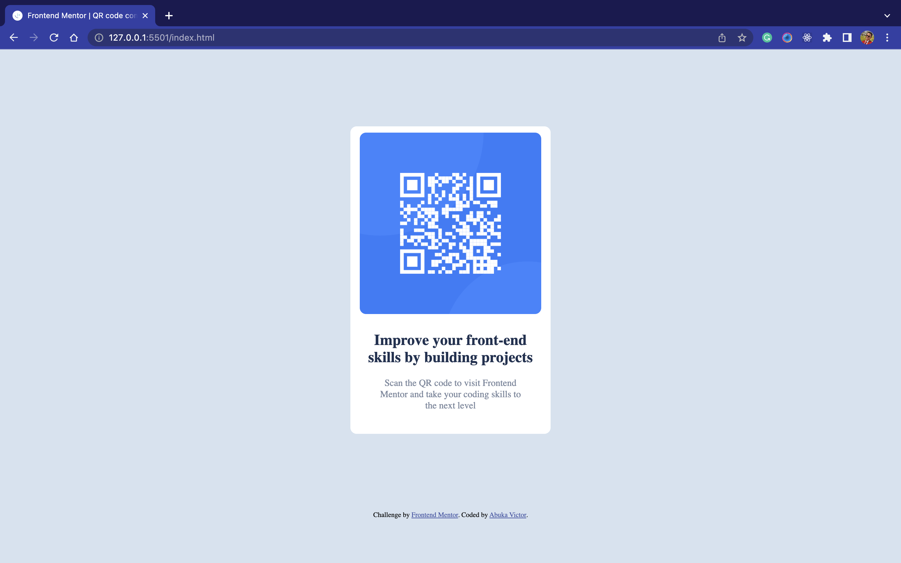

# Frontend Mentor - QR code component solution

This is a solution to the [QR code component challenge on Frontend Mentor](https://www.frontendmentor.io/challenges/qr-code-component-iux_sIO_H). Frontend Mentor challenges help you improve your coding skills by building realistic projects.

## Table of contents

- [Frontend Mentor - QR code component solution](#frontend-mentor---qr-code-component-solution)
  - [Table of contents](#table-of-contents)
    - [Screenshot](#screenshot)
    - [Links](#links)
  - [My process](#my-process)
    - [Built with](#built-with)
    - [What I learned](#what-i-learned)
    - [Continued development](#continued-development)
    - [Useful resources](#useful-resources)
  - [Author](#author)

### Screenshot



### Links

- Solution URL: [Click here to view the solution on Frontend Mentor](https://www.frontendmentor.io/solutions/qr-component-with-css-flexbox-YTKz42-ayO)
- Live Site URL: [Click here to check out the live site](https://qrcompfm.netlify.app/)

## My process

For these type of projects, typically I love to design as I go. So a little html there, a little css to go with it immediately so the project slowly comes to life. I draw and color at the same time. :-)

### Built with

- Semantic HTML5 markup
- CSS custom properties
- Flexbox
- Desktop-first workflow
- Media Queries

### What I learned

The major thing I learned in this project is getting this little box to be responsive across devices. I played around a lot to understand the min/max-width and the min/max-height for my media queries and because I expereinced some bugs it made me read more about media queries and I learned that the order in which the media queries are written in themselves can also affect the output. Of course I learned that you can do cool stuff like this ⬇️ also

```css
@media (600px <= width >= 800px) {
}
```

### Continued development

For future projects, I would love to take a mobile-first approach just to see.

### Useful resources

- [CSS Tricks](https://www.css-tricks.com)
- [MDN Docs](https://developer.mozilla.org)

These helped me to learn better how to use media queries.

## Author

- Website - [Victor Abuka](https://www.victorabuka.netlify.app)
- Frontend Mentor - [@Abuka-Victor](https://www.frontendmentor.io/profile/Abuka-Victor)
- Twitter - [@abukaofficial](https://www.twitter.com/abukaofficial)
